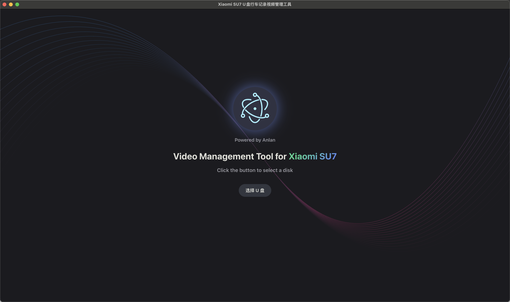

# Xiaomi SU7 Video Manager

小米 SU7 行车记录视频管理工具，一个基于 Electron + Vue 3 开发的跨平台桌面应用。

## 功能特点

- 🎥 多角度视频管理：支持查看和管理不同角度的行车记录视频
- 📅 按日期分组：自动按日期对视频进行分组展示
- ⏱️ 时长统计：显示每个日期视频的总时长
- 🔄 自动播放：支持视频自动播放和手动控制
- 📤 导出功能：支持将视频导出到指定目录
- 🔄 自动更新：支持应用自动更新
- 🌐 跨平台：支持 Windows 和 macOS 系统

---

### 软件界面预览



*应用启动界面，支持一键选择U盘。*


*多画面同步播放与管理，支持前后左右多角度视频同步浏览。*

---

## 系统要求

- Windows 10 或更高版本
- macOS 10.15 或更高版本
- 至少 4GB 内存
- 至少 1GB 可用磁盘空间

## 安装说明

### Windows

1. 下载最新的安装包（.exe 文件）
2. 双击安装包运行
3. 按照安装向导的提示完成安装
4. 从开始菜单或桌面快捷方式启动应用

### macOS

1. 下载最新的 DMG 文件
2. 双击 DMG 文件打开
3. 将应用拖到 Applications 文件夹
4. 从启动台或 Applications 文件夹启动应用

## 开发指南

### 环境要求

- Node.js 20.0.0 或更高版本
- npm 10.0.0 或更高版本

### 安装依赖

```bash
npm install
```

### 开发模式

```bash
npm run dev
```

### 构建应用

Windows:
```bash
npm run build:win
```

macOS:
```bash
npm run build:mac
```

### 项目结构

```
src/
├── main/           # 主进程代码
├── preload/        # 预加载脚本
├── renderer/       # 渲染进程代码
└── utils/          # 工具函数
```

## 技术栈

- Electron
- Vue 3
- Vite
- electron-builder
- electron-updater

## 主要依赖

- @electron-toolkit/preload: ^3.0.1
- @electron-toolkit/utils: ^4.0.0
- electron-log: ^5.4.0
- electron-updater: ^6.6.2
- vue: ^3.5.13

## 开发依赖

- @vitejs/plugin-vue: ^5.2.3
- electron: ^35.1.5
- electron-builder: ^25.1.8
- electron-vite: ^3.1.0
- prettier: ^3.5.3
- vite: ^6.2.6

## 构建配置

### Windows

- 使用 NSIS 安装程序
- 支持自定义安装目录
- 创建桌面和开始菜单快捷方式
- 支持卸载时清理应用数据

### macOS

- 支持 x64 和 arm64 架构
- 生成 DMG 安装包
- 支持自动更新

## 更新日志

### v1.0.0

- 初始版本发布
- 支持基本的视频管理功能
- 支持 Windows 和 macOS 平台

## 贡献指南

1. Fork 本仓库
2. 创建您的特性分支 (`git checkout -b feature/AmazingFeature`)
3. 提交您的更改 (`git commit -m 'Add some AmazingFeature'`)
4. 推送到分支 (`git push origin feature/AmazingFeature`)
5. 打开一个 Pull Request

## 许可证

本项目采用 MIT 许可证 - 查看 [LICENSE](LICENSE) 文件了解详情

## 作者

- Anlan

## 致谢

- 感谢所有为本项目做出贡献的开发者
- 特别感谢 Electron 和 Vue 团队提供的优秀框架
